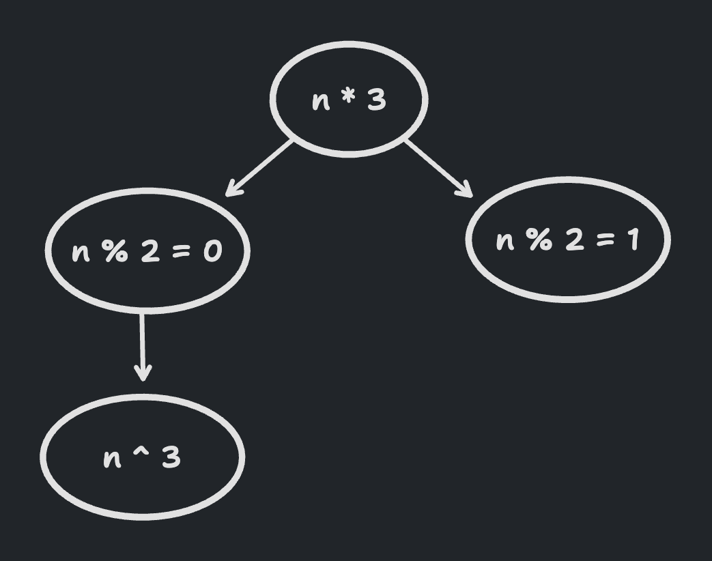

# materialite

---

**This project is not ready for public consumption**. All APIs are currently being overhauled to better support integration with existing databases. Join and Reduce are naively implemented at the moment.

---

Incremental view maintenance for JavaScript.

Problem --

You have a pipeline:

```
data.map(...).filter(...).reduce(...)
```

which you don't want to re-run from scratch each time something in `data` changes. Instead you'd like to only run against the data that changed and have your result incrementally updated. That's what this is for.

## Demo UIs built on Materialite:

- [Simple Task App & Linear clone](https://vlcn-io.github.io/materialite/)
- [A walkthrough of building an app on top of materialite & differential dataflow](https://github.com/vlcn-io/materialite/blob/main/demos/react/walkthrough/walkthrough.md)

## Install & Build

```sh
pnpm install
cd buildall
pnpm watch
```

## Test

Prerequisite: `pnpm install`

```sh
pnpm test
```

# API

> A walkthrough of building a React Tasks app with Materialite can be found here: https://github.com/vlcn-io/materialite/blob/main/demos/react/walkthrough/walkthrough.md

The main concepts in `Materialite` are:

1. Sources
2. Streams
3. Materialized Views

Everything starts with a `Materialite` instance. This instance is used to create data sources, connect third party sources and commit transactions. Sources emit streams against which computation (map/filter/reduce/join/count/union) can be written. Those streams can then be materialized into an incrementally maintained collection that represents the results of the computation.

```ts
const materialite = new Materialite();
const source = materialite.newSortedSet(comparator);
const view = source.stream.map(...).filter(...).materialize();
materialite.tx(() => {
  source.add(...);
  source.add(...);
  source.add(...);
});
```

After having a `Materialite` instance, sources is the first concept to understand.

## Sources

All computation starts with a source that is obtained from a `materialite` instance. A source is a collection to which you:

1. Add and remove values via `source.add` and `source.remove`
2. Attach pipelines

Along with the ability to define custom sources, there are three built in sources in Materialite:

1. Stateless Set
2. Sorted Set
3. Immutable Sorted Set

Once you have a source you can build compute pipelines against it by attaching `map`, `reduce`, `filter`, `join`, `count`, etc. to that source's `stream`.

### materialite.newStatelessSet<T>()

A stateless set is a set which does not hold onto its value. Values added or removed from a stateless set are passed along
to the compute pipelines attached to the set.

The advantage of a stateless set is that you only pay the memory cost of your final view and any operators which allocate. The disadvantage is that all pipelines must be attached to the set before any values are added or removed. If pipelines are attached later, they have no way of getting previously added values.

```ts
const materialite = new Materialite();
const source = materialite.newStatelessSet<number>();
// pipelines should be added to the source before values
// needed by the pipeline are added to the source.
source.stream.filter(...).map(...)...;
source.add(...);
source.delete(...);
```

### materialite.newSortedSet<T>(comparator)

A set which is sorted and holds onto its current state. Values added or removed from the set are passed along
to the compute pipelines attached to the set.

The advantage of this stateful set, over a stateless set, is that pipelines can be attached to the source even after values have already been added. These pipelines will be run with all historical values contained in the set in order to catch them up to current time.

Another nice property of the sorted set is that it is sorted. Materialized views that use the same ordering as the underlying set can be constructed more quickly. This is useful in situations where queries can change dynamically. E.g., users modifying a set of filters.

```ts
const Task = {
  id: string;
  dueDate: number;
};
const materialite = new Materialite();
const source = materialite.newSortedSet<Task>((l, r) => {
  const comp = l.dueDate - r.dueDate;
  // If items have the same date we need to compare on primary key to
  // ensure the items are distinct
  if (comp === 0) {
    return l.id.localeCompare(r.id);
  }
  return comp;
});
source.add(...);
source.delete(...);

// we can inspect all the values in the source
// since it retains them
const set = source.data;
for (const v of set) {
  console.log(v);
}

// We can attach pipelines even after values were added to the source.
// The pipelines will receive those past and all future values.
source.stream.filter(...).map(...)...;
```

### materialite.newImmutableSortedSet<T>(comparator)

The same as `sortedSet` except that the underlying set is a [persistent or immutable data structure](https://en.wikipedia.org/wiki/Persistent_data_structure). This means that every modification of the set creates a new version of that set. `Materialite` uses [structural sharing](https://en.wikipedia.org/wiki/Persistent_data_structure#Trees) between versions so this copying is relatively cheap and efficient.

`ImmutableSortedSet` does not hold on to old versions automatically but allows the developer to retain them if needed.

E.g.,

```ts
const materialite = new Materialite();
const source = materialite.newImmutableSortedSet<number>(comparator);
const v1_data = source.data;
const v2_data = source.add(1);
const v3_data = source.add(2);
const v4_data = source.delete(2);
```

### materialite.connectSource<T>(source)

If the three sources above are not sufficient or you'd like to integrate directly to something like SQLite, IndexedDB or some other key-value store `connectSource` is available to do this.

## Streams

Each source has an associated `stream` object. It is against the `stream` object that compute pipelines are built using `map`, `filter`, `reduce`, `join`, etc. Each operation against a stream returns a new stream.

```ts
const timesThree = source.stream.map((n) => n * 3);
```

This allows forking streams and creating a graph of computation.
In other words, you can share sections of streams with other streams.

```ts
const timesThree = source.stream.map((n) => n * 3);
const timesThreeEven = timesThree.filter((n) => n % 2 === 0);
const timesThreeOdd = timesThree.filter((n) => n % 2 === 1);
const timesThreeEvenCubed = timesThreeEven.map((n) => Math.pow(n, 3));
```



## Materialized Views

A stream can either be used directly, to observe and/or operate on each delta or it can be materialized into a "view."

In practice this means that a JavaScript collection is created which represents the result of the computation of the stream. As data is added or removed from the source, this collection is incrementally updated.

There are a few kinds of materializations:

1. ImmutableSortedSet
2. MutableSortedSet
3. Array (plain old JS Array)
4. CopyOnWriteArray (plain old JS Array but we produce a new one on each update)
5. Map (plain old JS Map)
6. CopyOnWriteMap (plain old JS Map but we produce a new copy on each update)
7. Custom

## React Demo

installed & built.

```sh
cd demos/react
pnpm dev
```

# TODO:

- [ ] Comparator for difference stream so equality can be key based?
- [ ] Better performing tree other than red-black tree? For `Index` and consolidation functions
- [ ] Re-write Join and Reduce to be more efficient
- [ ] Handle `take` and pagination
- [ ] Explore materialization structures
- [ ] Sorted sources for joins?
