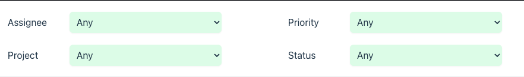

# Materialite Demo App Walkthrough

Think of Materialite as a database. A database that can efficiently respond to changes in data.

Think of the react demo application as an app where all state is stored in the database. Rather than ever using `useState` and `setState` we read and write state to/from the database.

> ⚠️ Note that I'm still figuring out the best APIs to expose to developers and there are still bugs 🐛 in Materialite.

## The Demo App

The demo app is a simple task tracking app. There's:

1. A table of tasks
2. A detail task view
3. A task filter

The state of each of these components is stored in the DB. Each of these components also is re-rendered via incrementally maintained subscriptions against the DB. The demo is seeded with 1 million tasks.

[materialite-react-demo.webm](https://github.com/vlcn-io/materialite/assets/1009003/22798248-2930-4f84-bfc9-a066f6eb7481)

## main.tsx

`main.tsx` is the component used to mount into the DOM. All it does is mount and render `TaskApp` into a DOM element.

```ts
ReactDOM.createRoot(document.getElementById("root")!).render(<TaskApp />);
```

## DB.ts

> Think of the react demo application as an app where all state is stored in the database.

`DB.ts` is the core entrypoint to our database and where all state is read and written. Here we set up three collections or tables:

1. tasks
2. comments
3. appState

as well as a convenience function to start a new transaction.

```ts
const m = new Materialite();
export const db = {
  tasks: m.newSortedSet(taskComparator),
  comments: m.newSortedSet(commentComparator),
  appState: m.newSortedSet(appStateComparator),
  tx: m.tx.bind(m),
};
```

_[code](https://github.com/vlcn-io/materialite/blob/195b75d0093fe876b5ee9837e4d55ea3ff41b8aa/demos/react/src/data/DB.ts#L45-L50)_

Each collection requires a comparator so that:

1. We can access the backing data in sorted order, making things like pagination and comment lookup fast.
2. Replace duplicate items

`tasks` and `comments` are pretty obvious collections, `appState` less so. `appState` represents things like selected tasks, selected filters and other "ui level state" that you'd generally stick into `useState`. Managing this state in the DB has benefits discussed [here](https://riffle.systems/essays/prelude/).

Enforcing things like uniqueness constraints for a collection can be done via the comparator provided to the collection. E.g., we only allow one `filter` for a given key.

```ts
export const appStateComparator = (l: AppState, r: AppState) => {
  let comp = l._tag.localeCompare(r._tag);
  if (comp !== 0) return comp;

  switch (l._tag) {
    case "filter":
      // filters with the same key are removed and replaced with the new one
      // hence no comparison on value
      return l.key.localeCompare((r as Filter).key);
    case "selected":
      // we allow for many selected items, hence compare on id
      return l.id - (r as Selected).id;
  }
};
```

_[code](https://github.com/vlcn-io/materialite/blob/195b75d0093fe876b5ee9837e4d55ea3ff41b8aa/demos/react/src/data/DB.ts#L26-L39)_

## TaskApp.tsx

`TaskApp.tsx` is the root of our application. It:

1. Renders the child components: `TaskFilter`, `TaskTable`, and `TaskComponent`
2. Reads and writes task selection state

### Reading Selection State

Task selection state is queried directly from our DB via a `useQuery` hook made to integrate Materialite with React.

```ts
export default function TaskApp() {
  const [, selectedTask] = useQuery(
    () =>
      db.appState.stream
        .filter((s): s is Selected => s._tag === "selected")
        .materializeValue(null),
    []
  );
  // ...
```

_[code](https://github.com/vlcn-io/materialite/blob/195b75d0093fe876b5ee9837e4d55ea3ff41b8aa/demos/react/src/TaskApp.tsx#L8-L15)_

Any time task selection state changes, `useQuery` will return a new `selectedTask` value and re-render the component.

Note that `AppState` is a union type:

```ts
export type Filter = {
  _tag: "filter";
  key: keyof Task;
  value: string;
};
export type Selected = {
  _tag: "selected";
  id: number;
};

export type AppState = Filter | Selected;
```

_[code](https://github.com/vlcn-io/materialite/blob/195b75d0093fe876b5ee9837e4d55ea3ff41b8aa/demos/react/src/data/DB.ts#L15-L25)_

but our query only cares about the `Selected` type. Since `materialite` is in JS we get the nice feature of type narrowing when querying it.

```ts
.filter((s): s is Selected => s._tag === "selected")
```

_[code](https://github.com/vlcn-io/materialite/blob/195b75d0093fe876b5ee9837e4d55ea3ff41b8aa/demos/react/src/TaskApp.tsx#L12)_

### Writing Selection State

`TaskApp.tsx` has an `onTaskSelected` handler. Here we:

1. Remove the currently selected task (if there is one)
2. Write the newly selected task

This is done through normal set operations of `delete` and `add` using normal JS objects.

```ts
// ...
function onTaskSelected(task: Task) {
  db.tx(() => {
    if (selectedTask) {
      db.appStates.delete({ _tag: "selected", id: selectedTask.id });
    }

    db.appStates.add({ _tag: "selected", id: task.id });
  });
}
// ...
```

### Sub-Components

After setting out a subscription against the selected task query and a callback to write the selected task, `TaskApp.tsx` renders the sub-components that make up the app:

1. TaskFilter
2. TaskTable
3. TaskComponent

`TaskTable` and `TaskFilter` both require access to the same state: what the current filter set is. Note, however, that we don't have to pass this state around.

```ts
return (
  <div className="flex h-screen">
    <div className="w-3/4 bg-gray-100 overflow-y-auto">
      <TaskFilter />
      <TaskTable
        onTaskClick={onTaskSelected}
        selectedTask={selectedTask?.id || null}
      />
    </div>
    <div className="w-1/4 bg-white overflow-y-auto p-6">
      {selectedTask ? (
        <TaskComponent taskId={selectedTask.id} />
      ) : (
        <div>Select a task to view details</div>
      )}
    </div>
  </div>
);
```

_[code](https://github.com/vlcn-io/materialite/blob/195b75d0093fe876b5ee9837e4d55ea3ff41b8aa/demos/react/src/TaskApp.tsx#L27-L44)_

The reason is that components can share state directly through the database.

Lets take a look at `TaskFilter`.

## TaskFilter.tsx

The first thing that `TaskFilter` does is to subscribe to a query against the current application state, filtering down to the `filter` type, via the `useQuery` hook.

```ts
const [, filters] = useQuery(
  () =>
    db.appState.stream
      .filter((s): s is Filter => s._tag === "filter")
      .materialize(appStateComparator),
  []
);
```

_[code](https://github.com/vlcn-io/materialite/blob/195b75d0093fe876b5ee9837e4d55ea3ff41b8aa/demos/react/src/TaskFilter.tsx#L9-L15)_

This returns the set of rows that comprise the user's currently selected filter. The filter type is as follows:

```ts
export type Filter = {
  _tag: "filter";
  key: keyof Task;
  value: string;
};
```

_[code](https://github.com/vlcn-io/materialite/blob/195b75d0093fe876b5ee9837e4d55ea3ff41b8aa/demos/react/src/data/DB.ts#L15-L19)_

And the filter UI:



So each row is a key of `Task` and the currently set value to filter that key by.

The set of filters returned by the DB is then used to populate the filter UI.

```ts
const filtersObj = filters.reduce((acc, f) => {
  (acc[f.key] as any) = f.value;
  return acc;
}, {} as Partial<Task>);

// ...
<label className="m-2 inline-block w-24">Assignee</label>
<select
  value={filtersObj.assignee || ""}
  onChange={(e) => {
    controlChange("assignee", e.target.value || undefined);
  }}
>
  <option value="">Any</option>
  {names.map(makeOption)}
</select>
```

_[code](https://github.com/vlcn-io/materialite/blob/195b75d0093fe876b5ee9837e4d55ea3ff41b8aa/demos/react/src/TaskFilter.tsx#L44-L56)_

We'll see a similar pattern in `TaskTable.tsx`.

The next thing `TaskFilter` does is set up a handler to write filter changes to the DB.

```ts
function controlChange(key: keyof Task, value?: string) {
  if (value != null) {
    db.appState.add({ _tag: "filter", key, value });
  } else {
    db.appState.delete({ _tag: "filter", key });
  }
}
```

This gives us a simple unidirectional dataflow. All writes flow down to the DB, all reads up from the DB. Reminiscient of a simple 90's coding style where the backend served the UI from state read directly out of a DB.

## TaskTable.tsx

TaskTable also needs the current set of filters. Rather than trying to pass callbacks around and threading dependencies through components that don't need to be aware of them, `TaskTable` simply queries the DB as `TaskFilter` does.

```ts
const [, filters] = useQuery(
  () =>
    db.appState.stream
      .filter((s): s is Filter => s._tag === "filter")
      .materialize(appStateComparator),
  []
);
```

So now how do we populate our table with data? We take the current set of filters and construct a query out of it.

```ts
function applyFilters(
  filters: Iterable<Filter>,
  tasks: DifferenceStream<Task>
) {
  let ret = tasks;
  for (const { key, value } of filters) {
    if (!value) continue;
    ret = ret.filter((task) => {
      return task[key] === value;
    });
  }
  return ret;
}
```

_[code](https://github.com/vlcn-io/materialite/blob/195b75d0093fe876b5ee9837e4d55ea3ff41b8aa/demos/react/src/TaskTable.tsx#L13-L25)_

That's quite compact but what this looks like, unrolled, is similar to:

```ts
tasks.filter(assigneeFilter).filter(priorityFilter).filter(projectFilter).filter(statusFilter)...
```

That's a lot of filters chained after one another! And remember we seeded the database of tasks with 1,000,000 tasks!

```ts
function fillWithSampleData() {
  m.tx(() => {
    for (const t of createTasks(1_000_000)) {
      db.tasks.add(t);
    }
  });
}
```

_[code](https://github.com/vlcn-io/materialite/blob/195b75d0093fe876b5ee9837e4d55ea3ff41b8aa/demos/react/src/data/DB.ts#L52-L60)_

This is where materialite shines: It'll keep that query efficiently maintained as your data changes, only processing the single item that changes rather than all million items each time. [some benchmarking of this](https://observablehq.com/@tantaman/materialite).

`TaskTable.tsx` then renders the results of that query via a virtualized table. Here we're using a very experimental / new feature: the ability for Materialite to hoist operations back to source collections. Essentially giving Materialite both stream processing and normal querying characteristics. This is described in more detail [here](https://github.com/vlcn-io/materialite/discussions/2).

> I don't currently like the APIs used to do this and this is currently a source of many bugs. The bugs exist by omission as I just haven't had the time to reconcile the streaming updates with [normal queries](https://tantaman.com/2022-05-26-query-planning.html) to seed the stream.
